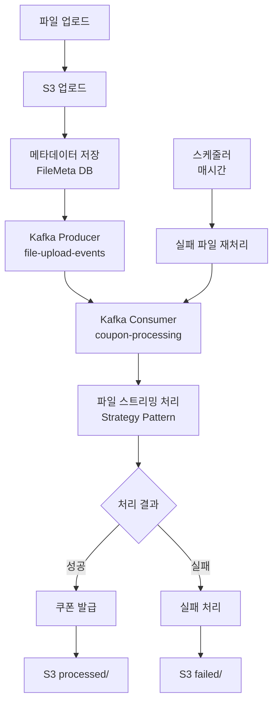

# 쿠폰 파일 처리 시스템 (Coupon File Processing System)

대용량 파일을 스트리밍으로 처리하여 사용자에게 쿠폰을 발급하는 고성능 비동기 처리 시스템입니다.

## 🎯 프로젝트 개요

이 시스템은 CSV, Excel, Text 파일을 업로드하면 내부의 사용자 정보를 추출하여 각 사용자에게 쿠폰을 발급하는 대용량 파일 처리 시스템입니다. Spring Boot 기반으로 구축되었으며, Kafka를 통한 비동기 메시지 처리, AWS S3를 통한 파일 저장, 그리고 배치 처리를 통한 안정적인 시스템 운영을 지원합니다.

## 🚀 주요 기능

### 📄 파일 처리
- **스트리밍 파일 처리**: 메모리 효율적인 대용량 파일 처리 (최대 100MB)
- **다중 파일 형식 지원**: CSV, Excel (.xlsx, .xls), Text 파일
- **전략 패턴**: 파일 타입별 확장 가능한 처리 로직

### ☁️ 클라우드 저장
- **AWS S3 통합**: 안전한 파일 저장 및 관리
- **자동 파일 분류**: uploads → processed/failed 폴더로 자동 이동

### 🔄 비동기 처리
- **Kafka 기반 메시지 큐**: 대용량 처리를 위한 비동기 아키텍처
- **배치 처리**: Spring Batch를 통한 안정적인 대량 데이터 처리
- **자동 재시도**: 실패한 작업 자동 재처리 (매시간)

### 🎫 쿠폰 시스템
- **사용자별 쿠폰 발급**: 파일에서 추출된 사용자 정보 기반 쿠폰 생성
- **처리 상태 추적**: 실시간 처리 상태 모니터링

## 🏗️ 시스템 아키텍처



## 📋 지원 파일 형식

| 확장자 | 형식 | 최대 크기 | 처리 방식 |
|--------|------|-----------|-----------|
| `.csv` | CSV | 100MB | Apache Commons CSV |
| `.xlsx` | Excel 2007+ | 100MB | Apache POI |
| `.xls` | Excel 97-2003 | 100MB | Apache POI |
| `.txt` | 텍스트 | 100MB | BufferedReader |

## 🛠️ 기술 스택

### Backend
- **Java 17** + **Spring Boot 3.5.3**
- **Spring Data JPA** + **H2 Database**
- **Spring Kafka** + **Apache Kafka**
- **Spring Batch** + **Quartz Scheduler**

### Cloud & Storage
- **AWS S3** - 파일 저장
- **Docker** + **Docker Compose** - 컨테이너화

### 파일 처리
- **Apache POI** - Excel 파일 처리
- **Apache Commons CSV** - CSV 파일 처리

## 🚀 빠른 시작

### 1. 사전 요구사항
- Java 17+
- Docker & Docker Compose
- AWS 계정 (S3 사용)

### 2. 환경 설정

#### AWS S3 설정
`src/main/resources/application.yml`에서 AWS 설정 수정:

```yaml
aws:
  accessKeyId: YOUR_ACCESS_KEY
  secretKey: YOUR_SECRET_KEY
  region: ap-northeast-2
  s3:
    bucket: your-bucket-name
```

### 3. 실행 방법

```bash
# 1. Kafka 컨테이너 시작
docker-compose -f docker-compose-kafka.yml up -d

# 2. Kafka 상태 확인
docker-compose -f docker-compose-kafka.yml ps

# 3. 애플리케이션 실행
./gradlew bootRun 
```


### 4. 서비스 확인
- **애플리케이션**: http://localhost:8088
- **H2 Console**: http://localhost:8088/h2-console
- **Kafka UI**: http://localhost:8080 (Kafka 실행 시)

## 📡 API 사용법

### 파일 업로드

#### 단일 파일 업로드
```bash
curl -X POST http://localhost:8088/coupons/files/upload \
  -F "file=@sample.csv"
```

### 파일 다운로드
```bash
curl -O http://localhost:8088/coupons/files/{fileId}
```


## 🔄 처리 플로우

1. **파일 업로드** 
   - 클라이언트가 파일을 업로드
   - 파일을 S3 `uploads/` 폴더에 스트리밍 저장

2. **메타데이터 저장**
   - FileMeta 엔티티에 파일 정보 저장 (status=false)

3. **메시지 발행**
   - Kafka `file-upload-events` 토픽에 파일 정보 전송

4. **비동기 처리**
   - Kafka Consumer가 메시지 수신
   - S3에서 파일을 스트리밍으로 읽어서 사용자 정보 추출

5. **쿠폰 발급**
   - 추출된 사용자 정보를 기반으로 쿠폰 생성

6. **결과 처리**
   - **성공**: status=true, 파일을 `processed/` 폴더로 이동
   - **실패**: status=false, 파일을 `failed/` 폴더로 이동

7. **재시도 메커니즘**
   - 스케줄러가 매시간 실패한 파일들을 자동으로 재처리

## 🔍 모니터링 및 관리

### Kafka 모니터링
- **Kafka UI**: http://localhost:8080
- 토픽 현황, 메시지 상태 실시간 확인

### 데이터베이스 관리
- **H2 Console**: http://localhost:8088/h2-console
- 파일 메타데이터 및 처리 상태 확인

### 로그 확인
```bash
# 애플리케이션 로그
tail -f logs/application.log

# Kafka 컨테이너 로그
docker-compose -f docker-compose-kafka.yml logs -f kafka

# 전체 컨테이너 로그
docker-compose -f docker-compose-kafka.yml logs -f
```
